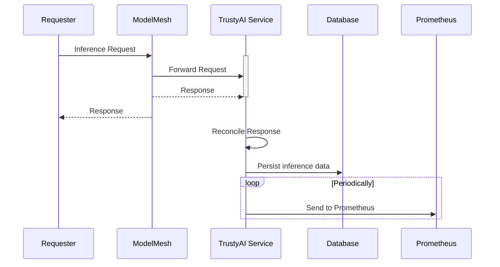

# Overview

```mermaid
sequenceDiagram
    participant R as Requester
    participant MM as ModelMesh
    participant TAI as TrustyAI Service
    participant DB as Database
    participant P as Prometheus

    R->>MM: Inference Request
    activate TAI
    MM->>TAI: Forward Request
    MM-->>TAI: Response
    deactivate TAI
    MM-->>R: Response
    TAI->>TAI: Reconcile Response
    TAI->>DB: Persist inference data
    loop Periodically
        TAI->>P: Send to Prometheus
    end
```